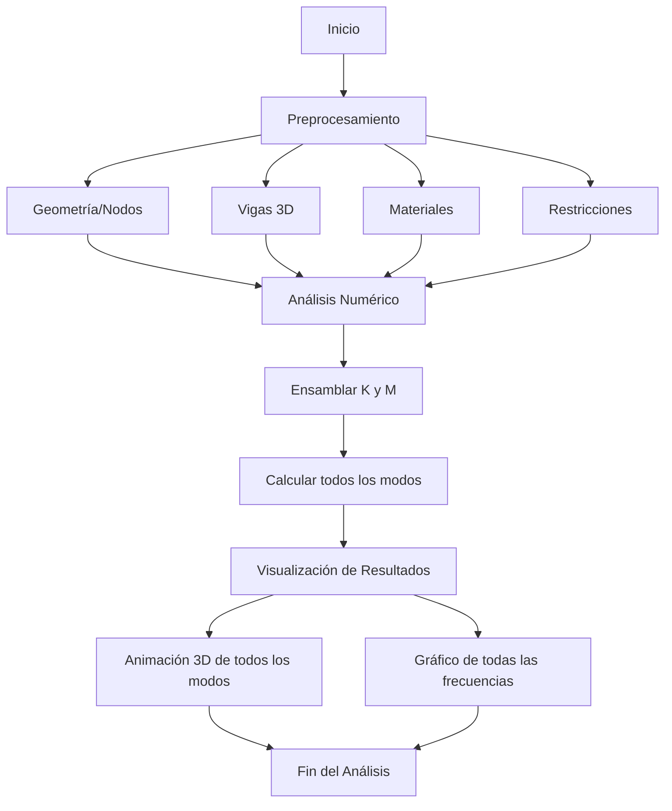
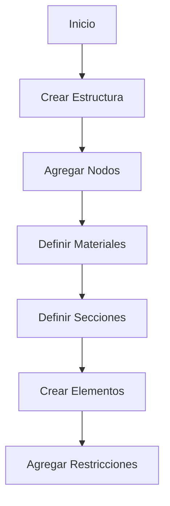
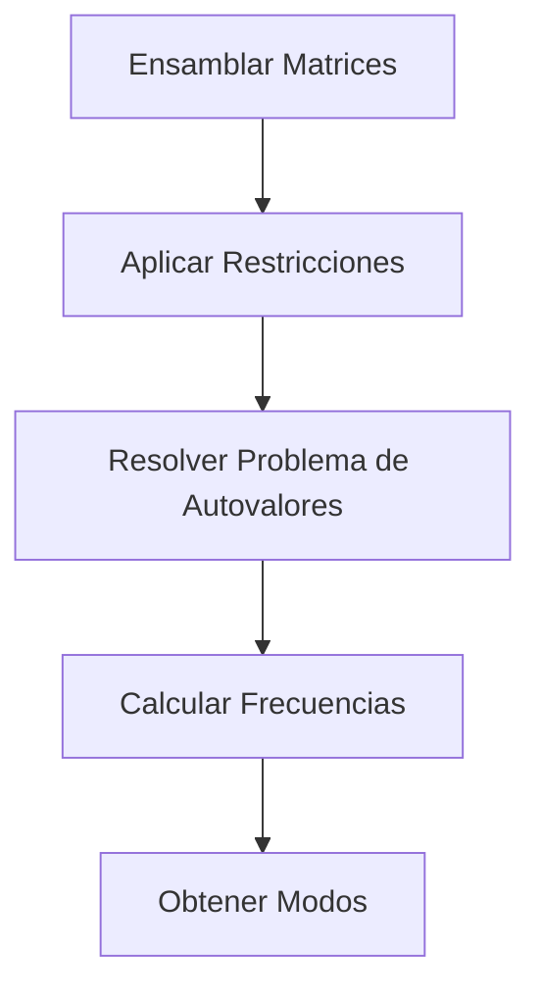
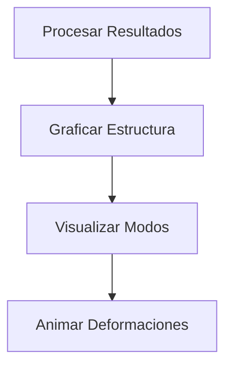

# Análisis Modal 3D para Estructuras

Este proyecto implementa un análisis modal tridimensional para estructuras usando el método de elementos finitos (MEF). Permite calcular las frecuencias naturales y modos de vibración de estructuras 3D.

## 🌟 Características

- Análisis modal 3D completo
- Soporte para elementos tipo viga 3D
- Análisis de múltiples modos de vibración
- Visualización de resultados
- Manejo de restricciones en nodos
- Diferentes tipos de materiales y secciones

### Flujo del Programa



## 📚 Teoría

### Análisis Modal

El análisis modal es una técnica utilizada para determinar las características dinámicas de una estructura en términos de:

- Frecuencias naturales
- Modos de vibración
- Factores de amortiguamiento modal

La ecuación fundamental del análisis modal es:

```Math
[K]{φ} = ω²[M]{φ}
```

Donde:

- [K] = Matriz de rigidez
- [M] = Matriz de masa
- ω = Frecuencia natural circular
- {φ} = Vector de forma modal

### Método de Elementos Finitos

El proyecto utiliza elementos tipo viga 3D con 6 grados de libertad por nodo:

- Traslaciones: ux, uy, uz
- Rotaciones: rx, ry, rz

## 🔄 Flujo del Programa

### 1. Definición de la Estructura



### 2. Análisis Modal



### 3. Visualización



## 🗂️ Estructura del Proyecto

```
02_analisis_modal_3d/
├── src/
│   ├── analysis/
│   │   ├── modal.py       # Análisis modal
│   │   └── assembler.py   # Ensamblaje de matrices
│   ├── structures/
│   │   ├── node.py        # Definición de nodos
│   │   ├── element.py     # Elementos estructurales
│   │   └── structure.py   # Clase principal de estructura
│   ├── visualization/
│   │   ├── plotter.py     # Visualización base
│   │   └── mode_plotter.py # Visualización de modos
│   └── examples/
│       └── bailey.py      # Ejemplos de uso
```

## 📝 Documentación de Funciones Principales

### Structure Class

```python
class Structure:
    """
    Clase principal para definir una estructura 3D.

    Attributes:
        nodes (list): Lista de nodos
        elements (list): Lista de elementos
        num_dofs (int): Número total de grados de libertad
        constraints (dict): Restricciones en los nodos
    """
```

### Modal Analysis

```python
def modal_analysis(structure, num_modes=5, ...):
    """
    Realiza el análisis modal de la estructura.

    Args:
        structure: Objeto estructura
        num_modes: Número de modos a calcular

    Returns:
        frequencies: Frecuencias naturales (Hz)
        mode_shapes: Formas modales
    """
```

## 🔧 Uso Básico

```python
from structures import Structure
from analysis import modal_analysis

# Crear estructura
structure = Structure()

# Agregar nodos
n1 = structure.add_node(0, 0, 0)
n2 = structure.add_node(0, 0, 1)

# Definir material y sección
material = Material(E=200e9, rho=7850)
section = Section(A=0.01, Ix=1e-6, Iy=1e-6, Iz=1e-6)

# Crear elemento
structure.add_element(n1, n2, section, material)

# Agregar restricciones
structure.add_constraint(n1, ['ux','uy','uz','rx','ry','rz'])

# Realizar análisis modal
frequencies, modes = modal_analysis(structure, num_modes=5)
```

## 🎯 Ejemplos

### Ejemplo: Bailey Bridge

```python
# Ver archivo examples/bailey.py para un ejemplo completo
# de modelado de un puente Bailey
```

## 📊 Visualización

El proyecto incluye herramientas de visualización para:

- Estructura sin deformar
- Modos de vibración
- Animaciones de deformación modal

## 🔍 Detalles de Implementación

### Matrices de Elemento

Las matrices de rigidez y masa se calculan para cada elemento considerando:

- Propiedades del material (E, G, ρ)
- Propiedades de la sección (A, Ix, Iy, Iz)
- Transformaciones geométricas 3D

### Solver Modal

El análisis utiliza el método de Lanczos para resolver el problema de autovalores generalizado, con opciones para:

- Número de modos
- Tolerancia
- Iteraciones máximas
- Regularización numérica

## 🛠️ Herramientas y Dependencias

- NumPy: Operaciones matriciales
- SciPy: Solvers numéricos
- Matplotlib: Visualización
- VTK: Visualización 3D

## 📈 Rendimiento

El código está optimizado para:

- Uso de matrices dispersas
- Cálculo eficiente de autovalores
- Manejo de estructuras grandes
